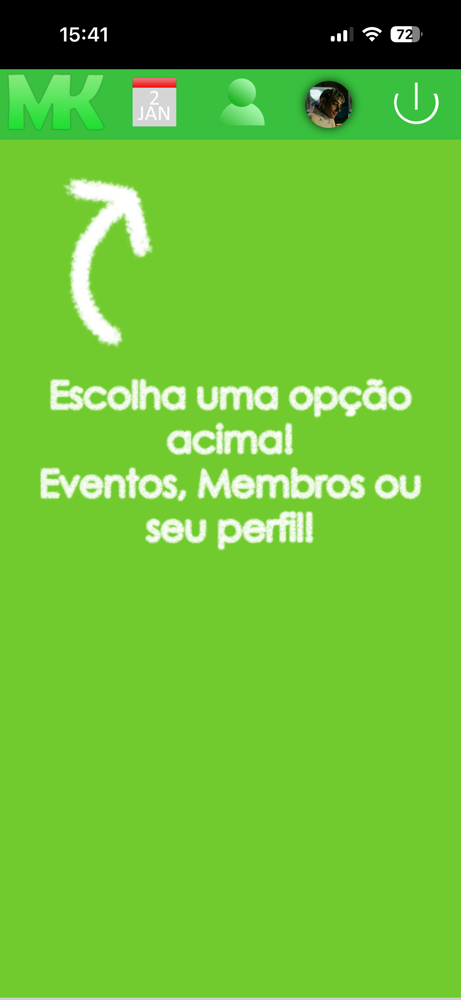
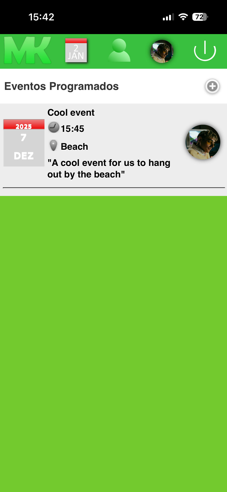
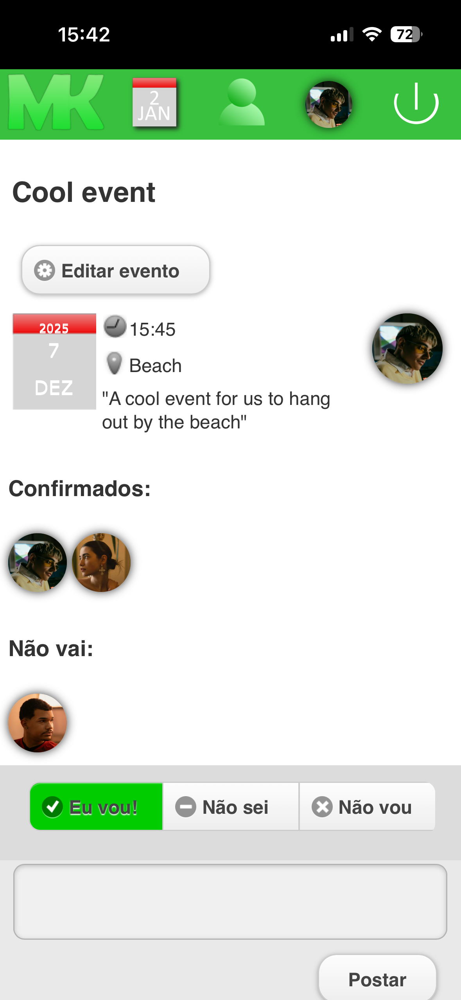
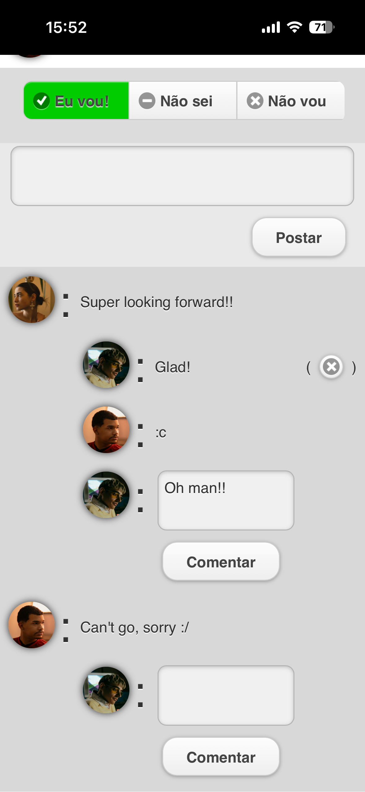
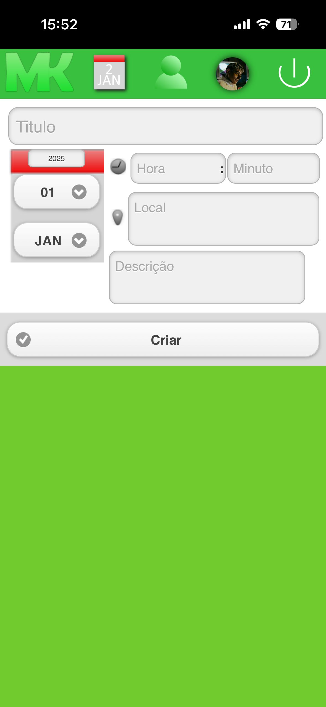
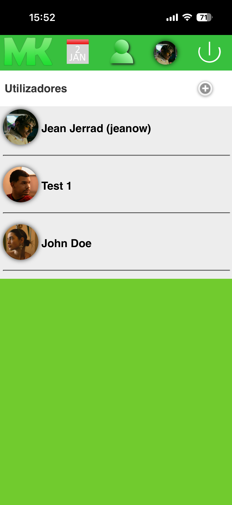
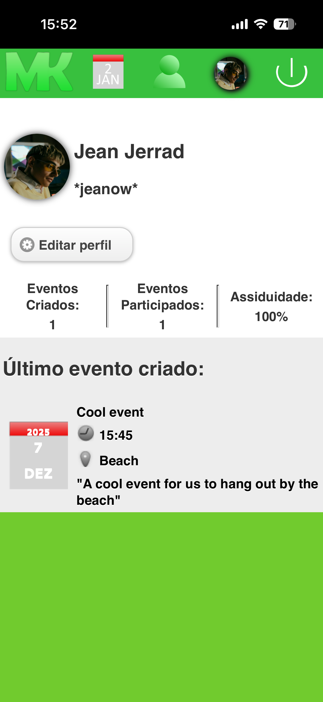
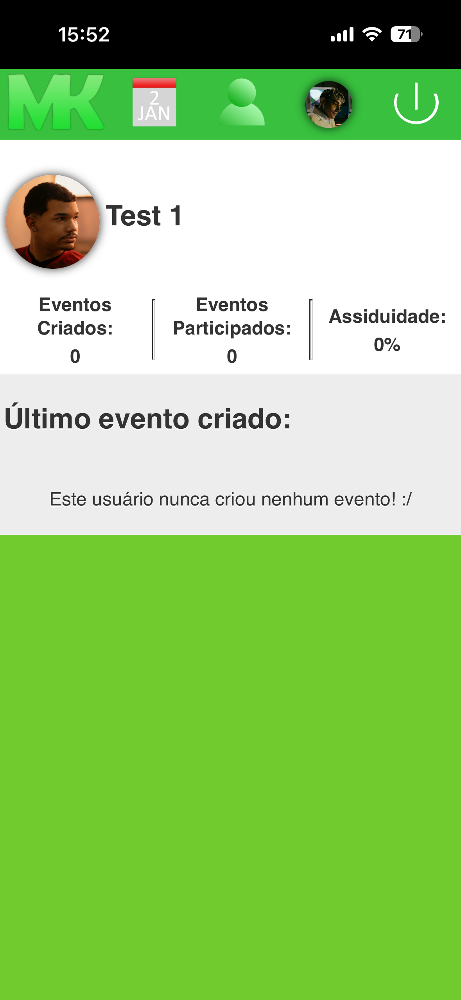

# 📅 School Events WebApp (2014 Revival)

[](https://jquerymobile.com/)
[](https://www.php.net/)
[](https://www.mysql.com/)
[](LICENSE)
[](#)

---

## 🕰️ About the Project

This is a **mobile-friendly event management webapp** I originally built back in **2014**, during high school in Brazil 🇧🇷. This was the first webapp I created from scratch!

At the time, a few of my friends (who were a year ahead of me) were graduating and moving on to university. Not everyone had Facebook yet, so I decided to create our **own private social app** to keep everyone connected and updated about upcoming events.

It's a simple yet complete app where users can:
- 📆 **View and create events**  
- ✅ **Confirm attendance** or mark that they won't attend  
- 💬 **Comment** and reply on events  
- 👥 **View profiles**, with stats like participation rate and events created  
- 🧑‍💻 **Admins can create users** and send invite codes  
- 🧭 **Onboarding tutorial** for first-time users  

Originally built with **jQuery Mobile 1.0**, **jQuery 1.6**, and **PHP/MySQL**, this version was updated to work on **modern PHP** (using 'mysqli' and secure features).

---

## 📱 Features

- **Mobile-first interface** powered by jQuery Mobile  
- **Event listing and creation**
- **Attendance system** with visual alerts (calendar icon)  
- **Comment threads** for engagement  
- **User profiles** with:
  - Profile picture and nickname  
  - Event stats (created, attended, attendance rate)  
  - Latest event organised  
- **Admin panel** for user management and invitations  
- **Invite links** ('invite.php?c=CODE') with installation tutorial for (the then versions of) Android/iOS  
- **First-login walkthrough** showing how to use each page  

---

## 🖼️ Screenshots

| WebApp on Safari (on iOs 26) | Main Page | Events |
|------------|---------|------------|
|  |  |  |  |

| Event Page | Comments | Adding Event |
|---------------|-----------|-----------|
|  |  |  |

| All Users | User Profile | Another User Profile |
|---------------|-----------------------|------------------|
|  |  |  |

---

## ⚙️ Tech Stack

| Layer | Technology |
|-------|-------------|
| **Frontend** | [jQuery Mobile 1.0](https://jquerymobile.com/), [jQuery 1.6](https://jquery.com/) |
| **Backend** | [PHP (modernised with mysqli)](https://www.php.net/) |
| **Database** | [MySQL](https://www.mysql.com/) |
| **Environment** | Originally hosted on shared web hosting (cPanel / PHP 5.x), now compatible with PHP 8+ |

---

## 📱 Give it a try!
You can visit the webapp on your mobile device and enjoy the retro experience!

Just access: [https://oldprojects.camk.net/friendsapp_2013](https://oldprojects.camk.net/friendsapp_2013) on your mobile phone.

* You can log in as "John Doe" using their login name "john_doe" and the password "s40RLK".
* Or you can also see the tutorial by logging in as "James Q" and the password "HvjPRa" (for this trial, this account will always display the tutorial when logging in).
* You can also check out James' invitation to join the app by accessing the link: [Check out the invite page](https://oldprojects.camk.net/friendsapp_2013/invite.php?c=vtHsGXQJC9).

---

## 🚀 Or run it on your machine!

1. Clone this repository:
   ```bash
   git clone https://github.com/caioponcedeleon/old_php_friends_app.git
   cd old_php_friends_app

2. Import the database:

- Create a MySQL database
- Import the .sql file (miqtekudo.sql)

3. Update your connection details in:
   ```bash
   /conectar.php

4. Run it locally or on your web server!

---

## 🧠 Fun Fact

This app was my first "social network", built before I even knew about frameworks or responsive design trends. It was designed from scratch with jQuery Mobile's “native app” look in mind — complete with page transitions, headers, and touch-friendly UI components.

It's a nostalgic throwback to the early mobile web era — and a great learning piece on how much web development has evolved since then.

## 🪪 License

This project is open source under the Apache 2.0 License.
Feel free to explore, fork, and adapt it for your own experiments or retro webapp collections.

---

To see more live-previews of old projects, click here:

<a href="https://oldprojects.camk.net/" target="_blank"></a>


✍️ *Project by me at age 16 (February 2014). Preserved here as part of my coding journey.*
